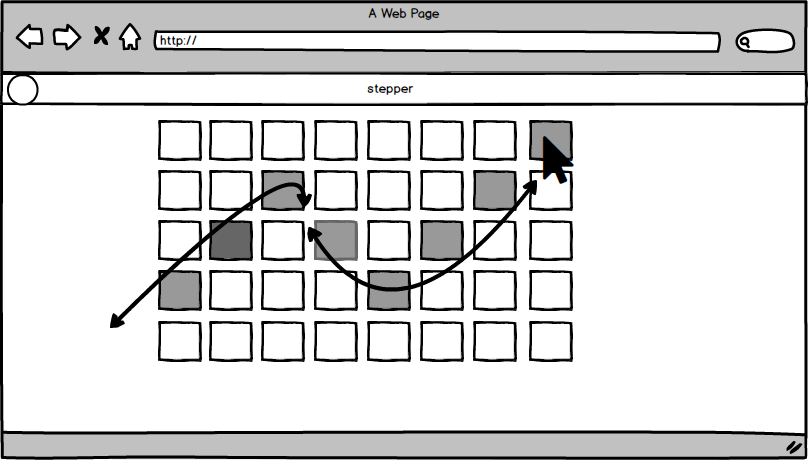
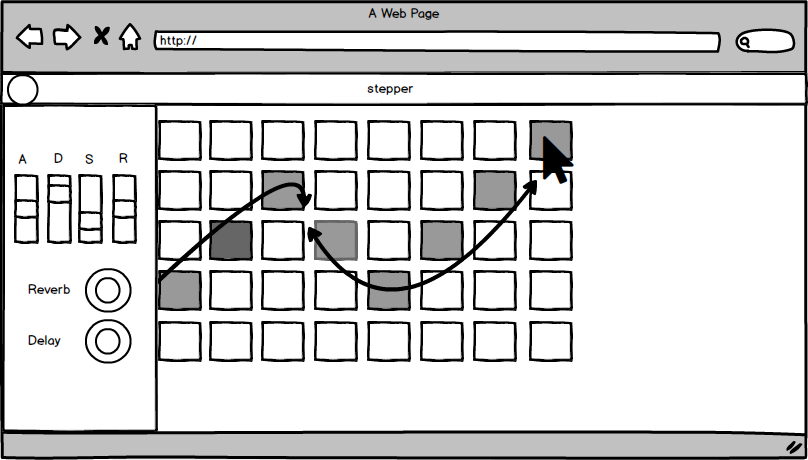

# Stepper

[Live Link](https://eakman.github.io/stepper/) (started working on it over the weekend)

stepper is a web based music synthesizer and step sequencer primarily powered by mouseover input.

* Mouse event controlled step sequencer
* Common music synthesis controls
  * Amplitude envelope filter
  * Tempo
  * Effects (delay, reverb, etc)
  * LFO
* Responsiveness to midi input
* Ability to change sequencer grid size

I will use a combination of JavaScript, HTML, CSS, and the ToneJS library to build it. One of the challenges I anticipate encountering is screen real estate. The grid takes up a lot of room and I want to be able to include the controls in a way which is intuitive and unobtrusive.

### Grid

Each columns represent an eighth note in the loop. Each square in the column represents a note of the pentatonic scale. By mousing over a square you change the color of the cell and activate the note. by mousing over it again you deactivate it.

## Side bar

The side bar would house the controls. At minimum I'd like to be able to control amplitude and have some basic effects.

##Phases

* Complete sequencer grid, set up side bar, and landing page
* Hook up effects and controls
* make responsive to midi input
