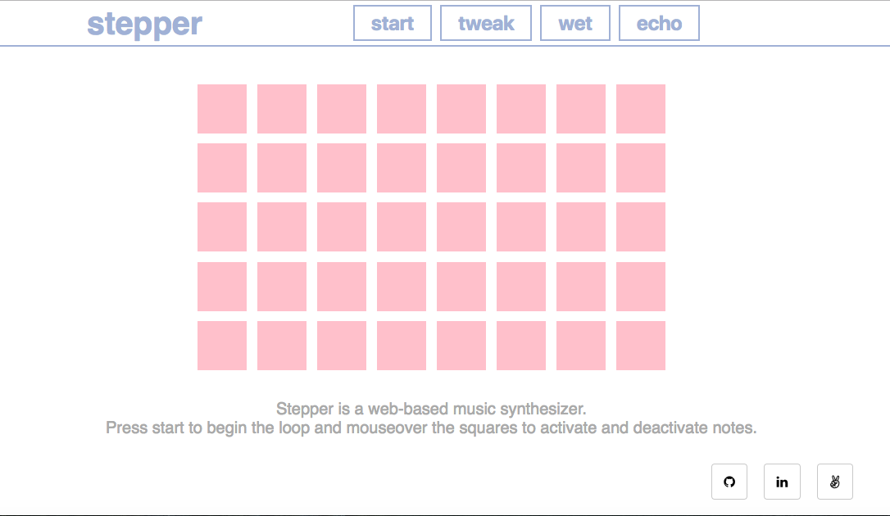
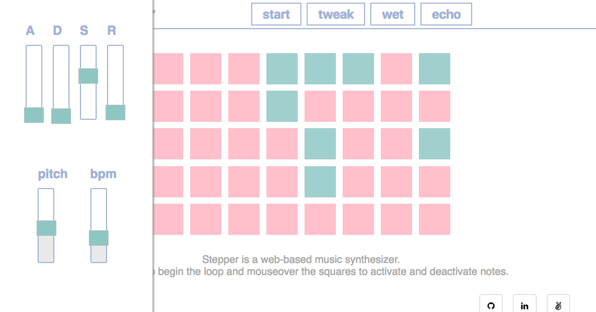

# stepper

[Live Link](https://eakman.github.io/stepper/)

Stepper is a web based musical instrument built using a JavaScript Web Audio framework called [Tone.js](https://github.com/Tonejs/Tone.js). The grid represents a 1-measure loop which can be started by pressong the start button. For each 8th note there's a column on the grid. There are 5 cells in each column and they're all mapped to a note of the pentatonic scale. Mouse over cells to activate or deactivate notes.

## tweaking and effects

Above the grid there is a preset reverb and delay as well as a tweak button. Clicking the tweak button opens up a tool bar with an [ADSR filter](http://en.wikiaudio.org/ADSR_envelope) as well as a pith control bpm control.

